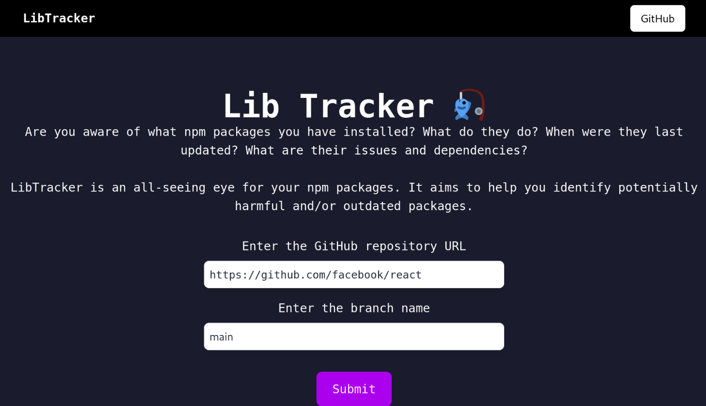

# LibTracker


LibTracker is a tool designed to help developers identify potentially harmful and outdated packages in their JavaScript projects. It provides an easy-to-use interface for scanning and analyzing dependencies, ensuring your project stays secure and up-to-date.




## What it does

- Scans JavaScript projects for dependencies
- Identifies outdated packages
- Highlights potentially harmful dependencies
- Provides detailed information about each package

## Planned Features

- [ ] Offers suggestions for updates and alternatives

## Technologies Used

  - Express.js
  - MongoDB
  - ReactJS
  - Tailwind CSS
  - Axios
  - GitHub OAuth

## Getting Started

### Prerequisites

- Node.js (v14 or later)
- MongoDB
- GitHub account (for OAuth)

### Installation

1. Clone the repository:
```
git clone https://github.com/TheRealSibasishBehera/lib-tracker.git
cd lib-tracker
```

2. Install backend dependencies:ncies:
```
cd backend
npm install
```


3. Set up backend environment variables:
Create a `.env` file in the `backend` directory and add the following:
```
MONGODB_URI=your_mongodb_connection_string
GITHUB_CLIENT_ID=your_github_oauth_client_id
GITHUB_CLIENT_SECRET=your_github_oauth_client_secret
```

4. Install frontend dependencies:
```
cd ../frontend
npm install
```
5. Start the backend server:
```
cd ../backend
npm start
```
6. In a new terminal, start the frontend development server:
```
cd ../frontend
npm start
```
7. Open your browser and navigate to `http://localhost:3000`

## Using Docker

1. Build the Docker image:
```
 docker build -t libtracker .
```
2.  Run the Docker container:
```
docker run -p 3000:3000
-e MONGODB_URI=your_mongodb_uri
-e GITHUB_CLIENT_ID=your_github_client_id
-e GITHUB_CLIENT_SECRET=your_github_client_secret 
```
## Usage

1. Log in using your GitHub account
2. Enter the URL of the JavaScript project you want to analyze
3. View the analysis results, including outdated and potentially harmful packages
4. Use the provided information to update your dependencies and improve your project's security